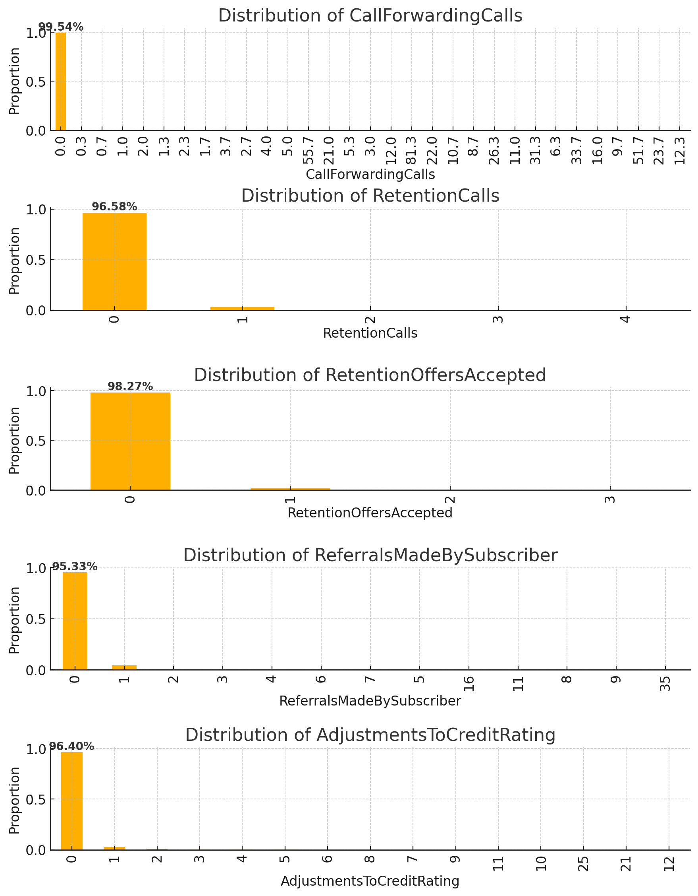
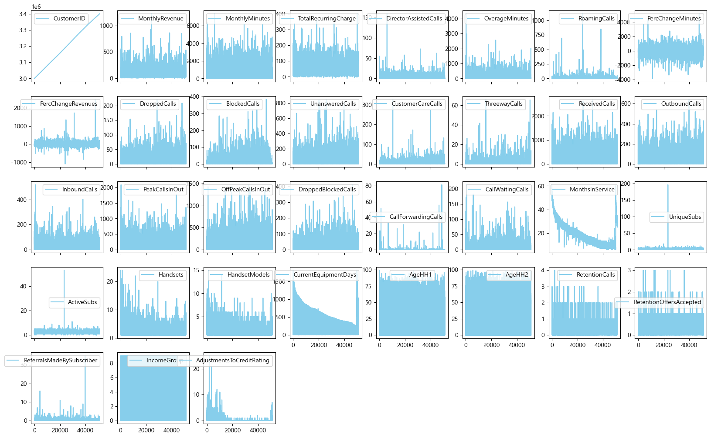

# SKN06-2nd-3Team

## 2차 프로젝트 - 통신사 고객 이탈 분석 및 예측 📈
  - 기간 2024.11.13 ~ 2024.11.14

## 0. 팀 소개 

  ### 팀명 
    가나디즈
  ### 팀원 👥
  
  | 이세화          | 김동훈        | 안형진       | 전수연         |
 

## 1. 프로젝트 개요 📌
통신사 개별 고객 정보와 이탈 여부 데이터를 통해 이탈 가능성을 유추하는 모델을 만들어 평가하는 프로젝트. 
데이터 수: 71047rows, 58 columns(features)
### 소개

### 필요성
- **비용 효율성**: 새로운 고객을 확보하는 비용이 기존 고객을 유지하는 비용보다 약 5배 더 많이 듭니다23. 
  따라서 기존 고객 유지는 마케팅 비용을 크게 절감할 수 있습니다. 
- **시장 포화**: 이동통신 시장이 성숙기에 접어들면서 신규 고객 확보가 어려워졌습니다. 따라서 기존 고객 유지가 더욱 중요해졌습니다. 
- **고객 데이터 활용**: 장기 고객의 데이터를 활용하여 더 나은 서비스와 맞춤형 마케팅을 제공할 수 있습니다. 
따라서 데이터 분석을 통해 고객의 이탈을 줄이는 방향으로 서비스를 개선해나가야 할 것입니다. 

### 목표
통신사 고객 이탈 예측을 통한 통신 시장에 대한 고잘 및 개선

## 2. 기술스택 

## 3. 과정 

### 데이터 전처리

1. column 삭제
- 도메인 지식 
도메인 지식으로 다음 column은 통신사 고객 이탈 여부와 관계가 매우 낮다고 판단하여 삭제함

OffPeakCallsInOut : 비피크 시간대의 통화 수 
HandsetRefurbished : 중고 기기 사용 여부 
TruckOwner : 트럭 소유 여부 
RVOwner : RV 소유 여부 
BuysViaMailOrder : 우편 주문으로 구매 여부 
RespondsToMailOffers : 우편을 통한 제안에 응답 여부 
OptOutMailings : 우편 발송 거부 여부 
OwnsComputer : 컴퓨터 소유 여부 
OwnsMotorcycle : 오토바이 소유 여부 

- 불균형
95% 이상이 하나의 값인 경우 해당 컬럼은 

    

 

### - 데이터 전처리 요약 🔍

#### 일부 열 제거
- CustomerID: 고객 아이디

####  결측치 처리

####  이상치 처리
- 

#### 범주형 데이터 처리
  

### - 모델 💻

#### 모델 평가

#### 적용된 모델:
- **LogisticRegression**:  
선형 분류 모델로, 입력 특성의 선형 결합을 사용하여 클래스 확률을 예측합니다. 이진 분류와 다중 분류에 모두 사용될 수 있으며, 해석이 쉽고 계산 비용이 적습니다. 
- **GradientBoostingClassifier**: 
여러 개의 약한 학습기(주로 결정 트리)를 순차적으로 학습시켜 강한 분류기를 만드는 앙상블 방법입니다. 각 단계에서 이전 모델의 오차를 보완하는 방식으로 학습합니다. 
- **RandomForestClassifier**: 
여러 개의 결정 트리를 독립적으로 학습시키고 그 결과를 종합하는 앙상블 방법입니다. 각 트리는 데이터의 부분집합과 특성의 부분집합을 사용하여 학습됩니다. 
- **KNeighborsClassifier**: 
새로운 데이터 포인트에 대해 가장 가까운 k개의 이웃 데이터 포인트들의 클래스를 참조하여 분류를 수행하는 비모수적 방법입니다. 
- **XGBClassifier**: 
그래디언트 부스팅의 최적화된 구현으로, 높은 성능과 빠른 학습 속도를 제공합니다. 병렬 처리와 정규화 기능을 포함하고 있습니다. 
- **DecisionTreeClassifier**: 
특성을 기반으로 데이터를 재귀적으로 분할하여 트리 구조의 분류 모델을 만듭니다. 해석이 쉽지만 과적합 위험이 있습니다. 
- **LGBMClassifier**: 
Light Gradient Boosting Machine의 약자로, 그래디언트 부스팅의 또 다른 최적화 구현입니다. 리프 중심 트리 성장 전략을 사용하여 더 빠른 학습과 더 나은 성능을 제공합니다. 

#### 데이터셋:

#### 분석 지표:
- Precision
- Recall
- F1 Score
- Kappa

#### 결과 요약:

#### 결론:

##  4. 한 줄 회고 📝

  
